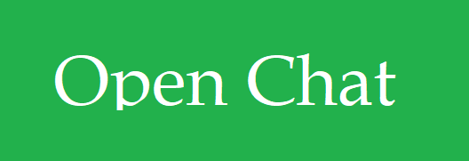

# Open Chat



A free and open source but not `realtime` chat app with server and client built in `python` using `flask`.

Server response `json` and save data as `json` file.

Client get `json` response and read it and send data to server.
## Installation
So, first we need to clone the repository.

```bash
gh clone Ghalbeyou/OpenChat
```

Then we need to install the dependencies.

```bash
pip install -r requirements.txt
```
After that, we got 2 folders:

```yml
- server
- client
```
go in each folder you want and run the following commands:

```bash
python3 server.py
python3 client.py
```
## Usage
To start the server, go to directory server and run the following command:

```bash
python3 server.py
```
after that, you can see server is running on port `8300`. witch is the default port.

Now, the `client` should be opened and connected to the server. so, in the `client` folder, run the following command:

```bash
python3 client.py
```
and then, it will ask for `username`, `ip` and `port`.

when all was correct the user connects to the server and finally can use the server.
Also, the limitations of the server are: `unlimited` number of users, `unlimited` number of messages and `unlimited` number of words.
## License
[`MIT`](https://opensource.org/licenses/MIT)
## Contacts
[`Ghalbeyou`](https://github.com/ghalbeyou) is owenr of this project and you can contact him on [`Github`](https://github.com/ghalbeyou).
